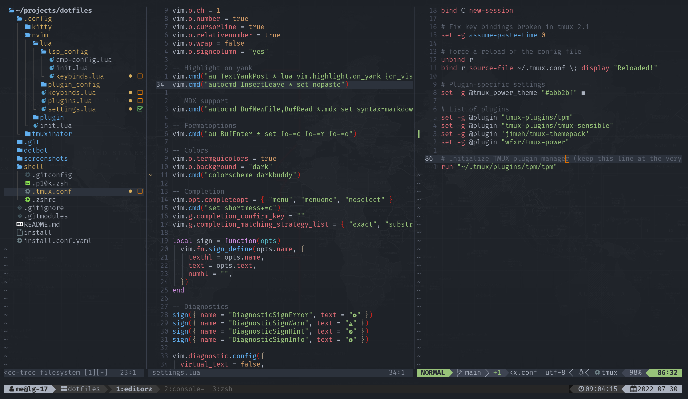
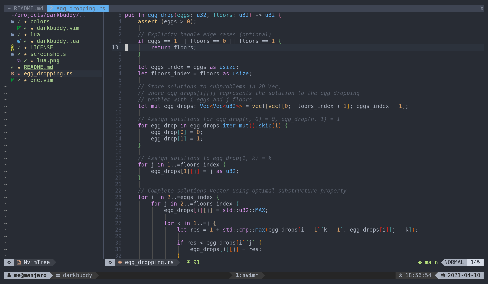

# Darkbuddy

A dark bootleg of [rakr/vim-one](https://github.com/rakr/vim-one) via
[Th3Whit3Wolf/onebuddy](https://github.com/Th3Whit3Wolf/onebuddy)

Has [nvim-treesitter](https://github.com/nvim-treesitter/nvim-treesitter) highlight groups

## Prequisites

- neovim >= 0.5

## Installation

Install with your favourite package manager:

```lua
-- packer.nvim
use { "~/projects/darkbuddy", requires = {{ "tjdevries/colorbuddy.vim" }} }
```

```vim
" vim-plug
Plug "tjdevries/colorbuddy.vim"
Plug "davidkeriuki/darkbuddy"
```

## Usage

```lua
-- Lua
vim.o.termguicolors = true
vim.o.background = "dark"
vim.cmd "colorscheme darkbuddy"
```

```vim
" Vimscript
set termguicolors
set background = "dark"
colorscheme darkbuddy
```

## Configuration

Enable italics:

```lua
-- Lua
vim.g.darkbuddy_italics = true
```

```vim
" Vimscript
let g:darkbuddy_italics = 1
```

## Screenshots




